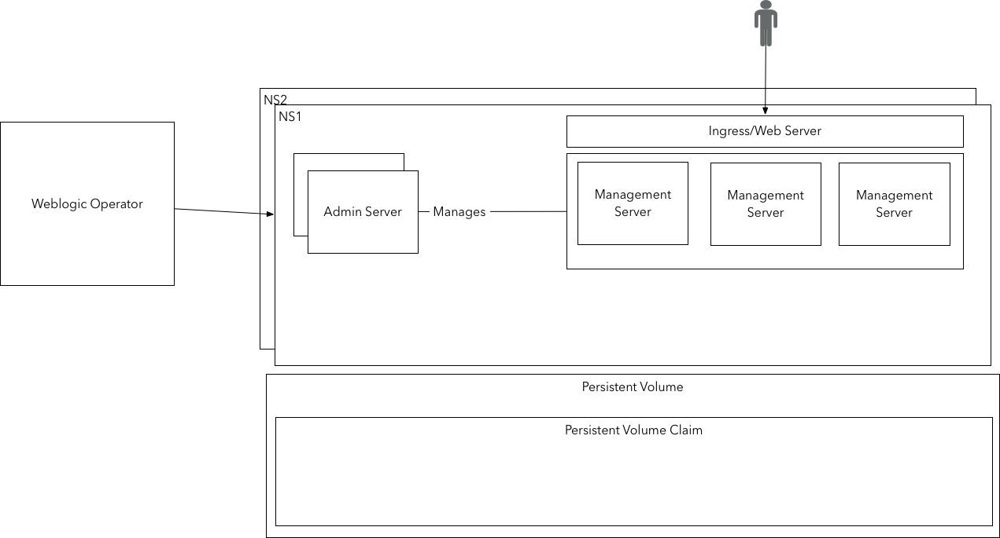

# Creating a Weblogic Domain using the Operator

## Prerequisite
A prerequisite of creating a Weblogic domain using these steps is to first have the Operator installed into your Kuberentes cluster - There are instructions for doing so in the same folder.
An additional prerequisite for this process is to be able to create a Persistent Volume (https://kubernetes.io/docs/concepts/storage/persistent-volumes/) In your cluster that supports the Access mode of ReadWriteMany.
I would caution against trying to use VsphereVolume(s) as of 2018/8/2 it does not appear to work with the access mode - something that is ambiguous



## Verifying the Persistent Volume
In order to verify that we're able to create and use Persistent Volumes I would suggest that we build some sample containers that utilize the persistent volumes and verify their access.

In `specs/weblogic` directory are a few files that you will use to create these persistent volumes and containers. `pv-test.yaml` will create the Persistent Volume, `pvc-test.yaml` will create the Persistent Volume Claim and `nginx.yaml` will create an Nginx reverse proxy (Just an arbitrary sample container) that attaches to the persistent volume.

`kubectl create -f pv-test.yaml`

`kubectl create -f pvc-test.yaml`

`kubectl create -f nginx.yaml`

After completing these steps you should verify that your claims and pods have completed creation successfully.

`kubectl get pvc`

```

NAME      STATUS    VOLUME    CAPACITY   ACCESS MODES   STORAGECLASS   AGE
nfs       Bound     nfs       10Gi       RWX                           11s

```

`kubectl get pods`

```
NAME                                 READY     STATUS              RESTARTS   AGE
nginx                                0/1       Running             0          8m
weblogic-operator-7759668968-6jw86   1/1       Running             0          22h
```

At this point I'd like to add another tool into your arsenal for debugging what's going on your cluster. If your not already aware you can use the

`kubectl proxy` on your local machine to open up a connection to the kuberenetes web interface. The web interface is then available at `http://localhost:8001/api/v1/namespaces/kube-system/services/https:kubernetes-dashboard:/proxy/#!/overview`

Now we can log into the pod we just created and make sure that there an appropriately attached storage entry.
`kubectl exec -it nginx /bin/bash --`  the `mount` command should have a line in it's output for the persistent volume.
127.0.0.1:/mnt/weblogic-pool on /mnt/weblogic-pool type nfs ...

If you navigate to that directory you should be able to create/delete/read files.

#Setting up resources for the domain installation

Create the namespace that we will be installing the domain into.
`kubectl create namespace weblogic-domain`


The final thing to do before we can create our operator is to create a kuberenetes namespace to contain the resources as well as secrets for both the weblogic domain and docker hub.


`kubectl create secret generic domain1-weblogic-credentials --from-literal=username=weblogic --from-literal=password=welcome1 --namespace weblogic-domain`

`kubectl create secret docker-registry my-docker-creds --docker-username=DOCKER_USERNAME --docker-password=SECRET --docker-email=DOCKER_EMAIL --namespace weblogic-domain`

As with the operator setup you will need to accept the license from Oracle for Weblogic  at https://store.docker.com/images/oracle-weblogic-server-12c


# Modifying our weblogic domain creation input scripts.
Next we're going to modify the parameters file that we use to initialize our weblogic domain. A sample version is provided in the kubernetes directory. I'd recommend copying the initial one so that way you easily refer to the defaults.

`cp create-weblogic-domain-inputs.yaml my-weblogic-domain-inputs.yaml`

Then we need to change some values for the `my-weblogic-domain-inputs.yaml` script. Uncomment the

`#domainUID: domain1` line, you can change the UID if you like, it just needs to be unique within your kuberenetes cluster.

For our VSphere hosted VM's we can't utilize HOST_PATH storage, since they might be allocated across VM's so instead we need to use the NFS share mentioned above. Change the line

`weblogicDomainStorageType: HOST_PATH` to `weblogicDomainStorageType: NFS`

you also need to change the field `weblogicDomainStorageNFSServer` to refer to the location of your NFS server:

`weblogicDomainStorageNFSServer: 127.0.0.1`

The Persistent Volume Claim needs to know what share the NFS server needs to mount as, change the weblogicDomainStoragePath to refer to the NFS share.

`weblogicDomainStoragePath: /mnt/weblogic-pool`

Update the namespace you wish to create your resources in.

`namespace: weblogic-domain`

For this example we're going to enable the T3 protocol port, it will not be available outside of the kuberenetes cluster. So I'll set the `t3PublicAddress` to the address reported by the `kubectl cluster-info` command.

`t3PublicAddress: operator-kube-cluster.pks.pivotal.io`

I'll set these fields to true:

`exposeAdminT3Channel: true`

`exposeAdminNodePort: true`


assign the name of the docker credential you created earlier
`weblogicImagePullSecretName: my-docker-creds`

`weblogicCredentialsSecretName: domain1-weblogic-credentials` 

## Create the Operator

Next we need to create an output directory that the creation script will use to store the intermediate files that it generates using the configuration we just filled out that it then uses as input into the operator.

`mkdir ../operator-output`


with these changes in place we're ready to create the operator, issue the command:

`./create-weblogic-domain.sh -i my-weblogic-domain-inputs.yaml -o ../operator-output`

Due to the networking configuration of within pivotal, even though we've created a nodePort service for the admin web service of the weblogic domain, we're still unable to access it. To resolve this issue, you can create an additional service. Use the `create-weblogic-admin-service.yaml` file as a template and then issue the `kubectl create -f create-weblogic-admin-service.yaml` command.
